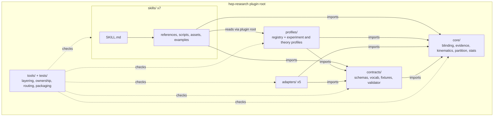

# General 5: Repository inspection -> architecture

**Request:** "Draw the architecture of this repository." The repository is the `hep-research` plugin itself (`plugins/hep-research/`, version 0.4.0). Source files were read first; only components found in them are drawn.
**Diagram type:** component / dependency diagram, technical level. Solid arrow = "reads from / imports", dashed = "is checked by". This is a structural diagram of files and allowed dependencies, not a runtime data flow.

**Workflow shown:** inspect -> component and connection tables with evidence -> diagram -> caption.

## Step 1 - what was read

`.claude-plugin/plugin.json` (name, version), `docs/architecture.md` (components table, how skills reach shared resources), `tools/check_layering.py` (the allowed import directions in its docstring), `core/OWNERS.json` (stewards of shared code), `profiles/registry.json`, and the directory listing. Nothing was inferred from file names alone.

| id | component | kind | evidence |
|---|---|---|---|
| plugin | Plugin root, installed by the host as one cached directory | container | `.claude-plugin/plugin.json`; `docs/architecture.md` section 1 |
| skills | Seven skills under `skills/` (hep-analysis, detector-response, hep-statistics, hep-theory, hep-computing, physics-ml, research-communication), each a `SKILL.md` with `references/`, `scripts/` and, for some, `assets/` and `examples/` | content | directory listing; `docs/architecture.md` section 1 |
| core | `core/` shared code (blinding, evidence, kinematics, partition, stats) with a steward per module | code | `core/OWNERS.json` |
| contracts | `contracts/` (JSON schemas, vocabularies, fixtures, validator, registry check) | code | directory listing; `tools/check_layering.py` |
| profiles | `profiles/` (registry plus experiment profiles ams-02, eic, synthetic-collider and theory profiles qed-benchmark, qcd-r-ratio) | content and data | `profiles/registry.json` |
| adapters | `adapters/` (batch-schedulers, hepdata, pyhf-combine, root-uproot, unbinned-fit) | code | directory listing |
| checks | `tools/` (layering, ownership, routing, packaging, reference inventory, aggregate runner) and `tests/` | verification | directory listing; `tools/run_all_checks.py` |

| from | to | meaning | evidence |
|---|---|---|---|
| skills | core, contracts, profiles, adapters | read on demand via `<plugin root>/...`; skill scripts import `core` and `contracts`, never another skill | `docs/architecture.md` section 1; `tools/check_layering.py` |
| contracts | core | may import | `tools/check_layering.py` ("contracts/ -> contracts, core") |
| profiles, adapters | core, contracts | may import; a profile reaches another profile only through `depends_on` | `tools/check_layering.py` |
| core | (nothing in the plugin) | imports only `core` and the mandatory environment; never names profiles, adapters or skills | `tools/check_layering.py` text rules |
| checks | all layers | the layering, ownership and routing checks read every layer | `tools/run_all_checks.py` |

## Step 2 - diagram

**Validation:** every box maps to a file or folder read in step 1; the seven skills are drawn as one repeated folder because they share the same layout, and no skill-to-skill edge is drawn because the layering check forbids one; every solid edge is an allowed direction from the `check_layering.py` docstring, and `core` has no outgoing edge because it may import nothing else in the plugin; no runtime (host or model) behavior is drawn because none was inspected. Rendered with `mmdc`.
**Caption:** Structure of the hep-research plugin. Seven description-routed skills read shared resources (profiles, contracts, core code, adapters) from the installed plugin root; dependencies point inward to `contracts/` and `core/`, which never depend on the layers above them. Solid arrows denote allowed imports or reads; dashed arrows denote the checks in `tools/` and `tests/`.
